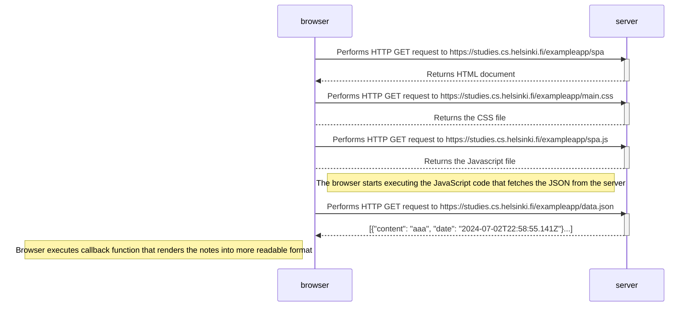

```mermaid
sequenceDiagram
    participant browser
    participant server

    browser->>server: Performs HTTP GET request to https://studies.cs.helsinki.fi/exampleapp/spa
    activate server
    server-->>browser: Returns HTML document 
    deactivate server

    browser->>server: Performs HTTP GET request to https://studies.cs.helsinki.fi/exampleapp/main.css
    activate server
    server-->browser: Returns the CSS file
    deactivate server

    browser->> server: Performs HTTP GET request to https://studies.cs.helsinki.fi/exampleapp/spa.js
    activate server
    server-->browser: Returns the Javascript file
    deactivate server

    Note right of browser: The browser starts executing the JavaScript code that fetches the JSON from the server

    browser->>server: Performs HTTP GET request to https://studies.cs.helsinki.fi/exampleapp/data.json
    activate server
    server-->>browser: [{"content": "aaa", "date": "2024-07-02T22:58:55.141Z"}...]
    deactivate server

    Note left of browser: Browser executes callback function that renders the notes into more readable format


```