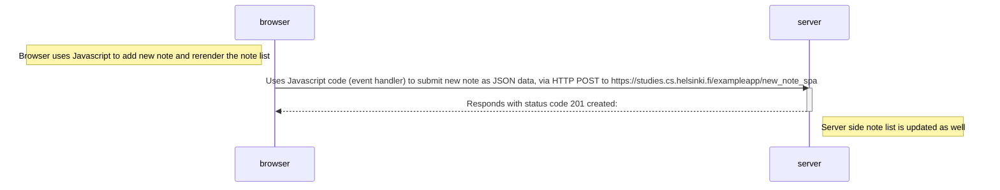

```mermaid
sequenceDiagram
    participant browser
    participant server

    Note left of browser: Browser uses Javascript to add new note and rerender the note list
    browser->>server: Uses Javascript code (event handler) to submit new note as JSON data, via HTTP POST to https://studies.cs.helsinki.fi/exampleapp/new_note_spa 
    activate server
    server-->>browser: Responds with status code 201 created:
    deactivate server
    Note right of server: Server side note list is updated as well
    


```